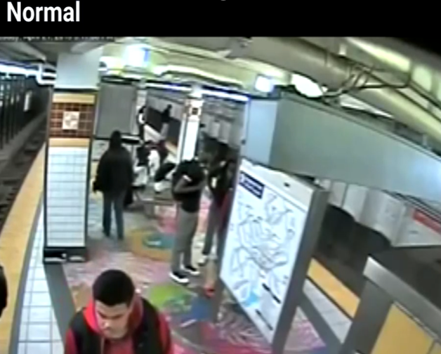
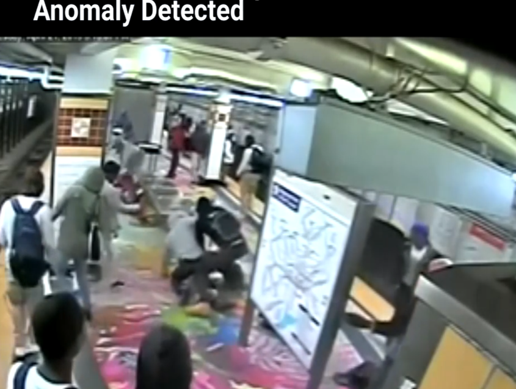

# CrimeSpotter-AI


---

##📌 Overview

**CrimeSpotter**  is an AI-powered surveillance monitoring tool that performs:

* Automated anomaly detection using CNN-based deep learning models trained on diverse  surveillance scenarios. 
* The system classifies video frames as normal activities or various types of security threats including violence, theft, accidents, and dangerous events.

Built with **TensorFlow**,**Keras**, and **OpenCV**, this solution addresses critical security challenges by combining robust computer vision with real-time classification capabilities.

---

##🛠️ Features

* 🧠**CNN-based detection** : for accurate anomaly classification across multiple categories
* 🚨**Multi-class detection**: Fighting, Assault, Burglary, Robbery, Shoplifting, Explosions, and more
* 📊**Comprehensive metrics**: ROC-AUC, precision, recall, F1-score analysis
* 🖼️**Data augmentation**: with rotation, shifting, flipping, and zoom transformations
* 📈**Performance visualization**: Training history, confusion matrices, ROC curves

---

##🔁 Workflow

```
1.Upload surveillance footage or image sequences
2.Preprocess and augment training data
3.Train CNN model with class-balanced datasets
4.Detect anomalies in real-time or batch processing
5.Generate alerts and visual evidence
6.Produce comprehensive reports with confidence scores
```


---

##🚀 Technologies Used

*🧠 **TensorFlow/Keras **: Deep learning framework for model training
*🖼️  **OpenCV **: Image processing and video handling
*📊  **Scikit-learn **: Model evaluation and metrics calculation
*📈  **Matplotlib/Seaborn **: Performance visualization
*🎨  **Plotly **: Interactive charts and dashboards
*🐼  **Pandas/NumPy **: Data manipulation and analysis

---

##🧪 Sample Detection Code
```python
from tensorflow.keras.models import load_model
from tensorflow.keras.preprocessing import image
import numpy as np
import cv2

# Load trained model
model = load_model('anomaly_detection_model.h5')

def detect_anomaly(frame):
    # Preprocess frame
    img = cv2.resize(frame, (224, 224))
    img_array = image.img_to_array(img)
    img_array = np.expand_dims(img_array, axis=0)
    img_array /= 255.0
    
    # Make prediction
    predictions = model.predict(img_array)
    anomaly_score = predictions[0][1]  # Assuming binary classification
    
    # Classify based on threshold
    if anomaly_score > 0.7:
        return "ANOMALY DETECTED", anomaly_score
    else:
        return "NORMAL", anomaly_score

# Process video frame
frame = cv2.imread('surveillance_frame.jpg')
result, confidence = detect_anomaly(frame)
print(f"Status: {result}, Confidence: {confidence:.2f}")
```

---

##📈 Model Performance

*✅ **Accuracy **: 80% achieved on test dataset
*📊 **Precision **: 82% for anomaly detection
*🔁 **Recall **: 78% capturing true positives
*🎯 **F1-Score **: 80% balanced performance metric

---

##🖼️ Outputs

Detection Performance

1) Normal

 
 
3) Anomaly




